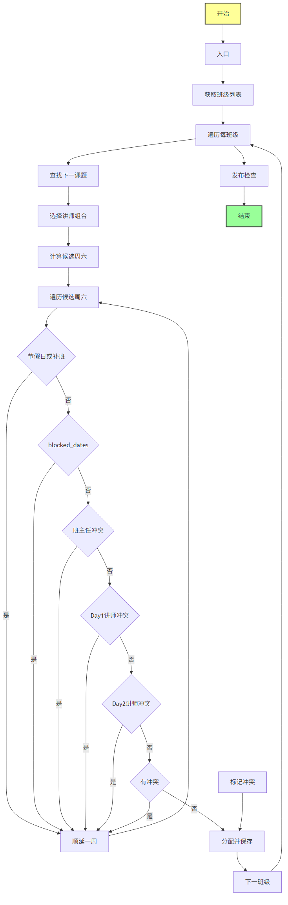

# 北清商学院排课系统 - 排课流程文档

## 概述

本文档描述排课系统的核心算法流程。排课分为两个主要场景：
1. **初始化阶段**：开设班级时的排课（`init_mock_classes()`）
2. **月度排课**：每月自动生成新的课程安排（`generate_schedule()`）

## 核心流程

在学院的制度中：“项目”是最高级单位，每个项目下可以开设多个班级；
当班级创建时，系统会根据培训大纲对该班级进行 **预排课**（一次性生成未来所有课题的周末档期，作为初始课表）。



## 关键决策点

### 1. 节假日与补班检查
- **函数**：`is_holiday()`（[backend/routes/schedule.py](../backend/routes/schedule.py)）
- **规则**：
  - 加载本地 `holidays_2026.json`（相对路径自动定位）
  - 判断标准：`holiday=true` 或 `after=true`（补班标志）
  - 补班日期（如春节后补班 02-28）同样标记为不可排课日期
  - 兜底：无法判断时默认为工作日

### 2. 班主任可用性
- 检查班主任是否在该日期已分配其他班级课程
- 检查 `constraints.homeroom_unavailable` 中的请假日期
- 若冲突，则顺延到下一周六

### 3. 讲师冲突（双讲师模式）
- **Day 1**（周六）：检查 `combo_id` 对应讲师是否已排课
- **Day 2**（周日）：检查 `combo_id_2` 对应讲师是否已排课（需查询其他班的 Day 2 讲师）
- 若冲突且模式为 `postpone`，则顺延；若为 `mark`，则标记为 `conflict`

### 4. 冲突处理策略
- **postpone**（默认）：发现冲突→顺延至下一周六→重新检查
- **mark**：发现冲突→仍使用该日期→标记 `status='conflict'`→后续手动处理或强制发布

## 月度计划（全学院排课）

每个月度计划的编制是在**全学院范围**内进行的，而非单个项目或班级。系统会提前一个月运行 `generate_schedule()`，
从所有状态为 `active`/`planning` 的班级中：

- 预选下一节未上课题，
- 处理临时冲突（节假日/补班、班主任、讲师冲突等），
- 确定周六/周日的授课教师组合，
- 插入或更新当月所有可安排课程（`status=scheduled`），
- 并在发布时生成冲突清单供人工处理。

这个过程是高校级别的计划制定，与项目制度无关，只考虑班级与师资资源。

## 主要函数

### 项目与班级创建

新增模型 `Project` 及 `Class.project_id` 字段，用于标识班级所属项目。
`/classes` POST 创建接口现在接受 `project_id`，并在完成后返回 `project_name`。

### 预排课（班级开设时）
**位置**：`backend/routes/classes.py` -> `auto_schedule_class()`

学院设立班级的同时，就要根据大纲预先排好全部课程。此流程会：
1. 读取该班级所属培训类型的所有课题
2. 自 `start_date` 起每 4 周安排一节（仅周六），
3. 避开节假日/补班，使用最新的教-课组合为每节课选定默认讲师，
4. 直接写入 `ClassSchedule`（状态为 planning）。

该逻辑在 `classes.create()` 中调用，可通过 `POST /classes` 的 `auto_generate` 参数控制是否执行。

### init_mock_classes()
**位置**：`backend/init_data.py`

创建模拟班级和初始课表。逻辑：
1. 为每个班级生成 8 节课（对应 8 个课题）
2. 从班级 `start_date` 起，每 4 周排一节课
3. 每个课题使用两位不同讲师（Day 1、Day 2）
4. **与你的修改**：加入冲突检测与顺延逻辑（避免同一班主任同日冲突、讲师重复）

### generate_schedule()
**位置**：`backend/routes/schedule.py` L444-L683

触发场景：前端调用 `/schedule/generate` API。逻辑流程：
1. 清除该月所有 `status in ('scheduled','planning')` 的记录
2. 遍历活跃班级，找每个班级的下一个未上课题
3. 为该课题选择 2 个不同讲师的 Combo（如无法找到，则重复使用同一讲师）
4. 遍历本月所有周六，逐个检查冲突
5. 若无冲突，分配该日期；若有冲突，根据模式（postpone/mark）处理

### _build_publish_checklist()
**位置**：`backend/routes/schedule.py` L35-L90

发布前的冲突审查。分类：
- **unresolved**：`status='conflict'` 的记录（需手动处理）
- **pending**：`status in ('planning','scheduled')` 的记录（未确认）
- **resolved**：已完成的课程

### publish()
**位置**：`backend/routes/schedule.py` L436-L468

发布月度计划。规则：
- 若有 `unresolved` 冲突且 `force_publish=false`，则返回 409 阻止发布
- 若 `force_publish=true`，则要求提供 `force_note`（备注） 并标记在冲突记录上
- 发布后将 `status='scheduled'` 更新为 `status='confirmed'`

## 修改记录

### 2026-02-26 修改

**目标**：不应在节假日或补班时排课

**修改点**：

1. **is_holiday() 增强**
   ```python
   # 原逻辑只判断 holiday=true
   # 新逻辑判断 holiday=true 或 after=true（补班）或名称包含"补班"
   is_makeup = ('after' in record) or ('补班' in (record.get('name') or '')) or record.get('workday', False)
   is_hol = bool(record.get('holiday', False) or is_makeup)
   ```

2. **init_data.py 中的 init_mock_classes()**
   - 加入循环检测冲突：班主任同日冲突、讲师被占用
   - 若发现冲突，顺延到下一周

3. **schedule.py 中的 generate_schedule()**
   - 已有完整的冲突检测逻辑（见流程图）

## 测试验证

运行以下命令验证 `is_holiday()` 对补班日期的判断：

```python
from backend.routes.schedule import is_holiday

# 补班日期应返回 True
dates = ['2026-01-04', '2026-02-14', '2026-02-28', '2026-05-09', '2026-10-10']
for d in dates:
    print(d, is_holiday(d))  # 应都为 True
```

## 已知限制

1. **讲师 Day 2 冲突检测**：当前只检查 `scheduled_date == sat` 的 `combo_id_2`，不包括跨日期的 Day 2（如上周的 Sunday 会与本周 Saturday 冲突），但这通常不是问题（因为周日和下一周六不同日）

2. **班主任多班级并行**：同一班主任同时持有多个班级时，系统能正确检测日期冲突，但不检测讲师是否过载

3. **强制发布**：系统允许强制发布有冲突的计划（带备注），这为人工调整留出灵活性，但需要谨慎使用

## 下一步建议

- [ ] 扫描当前数据库，找出所有落在节假日/补班的 ClassSchedule 记录
- [ ] 对落在冲突日期的记录执行自动或手动调整
- [ ] 重新运行 `init_data.py` 初始化数据
- [ ] 在前端排课画面中添加"冲突高亮"提示
